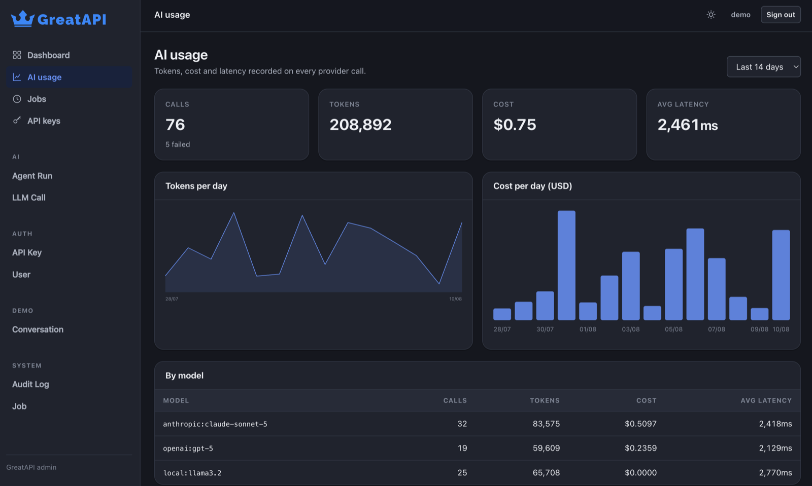

# Usage and cost

Every provider call writes a row: model, provider, tokens in and out, cost,
latency and outcome — attributed to the API key that authorised the request.
That is what makes `/admin/usage` real observability rather than a mockup.

Recording happens on its own database session, never the request's. A rollback
of a failed request must not erase the record of the tokens it already spent,
and a failure to record must never break a request.

## The dashboard

`/admin/usage` shows, over a window you choose:

- calls, tokens, cost and average latency
- tokens and cost per day
- a per-model breakdown, most expensive first
- recent agent runs, with their step counts



Charts are server-rendered inline SVG. No chart library and no CDN, so the admin
works offline and under a strict CSP.

## Configuring pricing

GreatAPI ships **no** prices for real provider models, on purpose. Published
rates change, differ by region and contract, and a framework quietly reporting a
number that is thirty per cent wrong is worse than one reporting nothing — you
would build budgets and alerts on it.

Token counts, latency and call volume work out of the box. Cost activates when
you say what you pay:

```python
from greatapi import ai

ai.register_pricing("anthropic:claude-sonnet-5", input_per_1m=3.00, output_per_1m=15.00)
ai.register_pricing("openai:gpt-5", input_per_1m=1.25, output_per_1m=10.00)
```

(Those figures are an example. Use your provider's pricing page and your own
contract.)

Or from the environment, which suits containers:

```bash
GREATAPI_AI_PRICING='{"anthropic:claude-sonnet-5": [3.0, 15.0]}'
```

Values are USD per million tokens, `[input, output]`. A model with no registered
price records a cost of `0.0` and is listed by `ai.unpriced_models()`.

## Querying it yourself

```python
from sqlalchemy import func, select
from greatapi.db import LLMCall

total = await session.scalar(
    select(func.sum(LLMCall.cost_usd)).where(LLMCall.created_at >= start_of_month)
)
```

```python
by_model = await session.execute(
    select(LLMCall.model, func.count(), func.sum(LLMCall.total_tokens))
    .group_by(LLMCall.model)
    .order_by(func.sum(LLMCall.cost_usd).desc())
)
```

## Turning it off

```bash
GREATAPI_AI_TRACK_USAGE=false
```

The tables still exist — they are part of the schema on every install — they
just stay empty.

## Retention

Nothing is deleted automatically. Prompts and completions are **not** stored, so
the rows are small, but they do accumulate. Trim them with a job:

```python
from datetime import timedelta
from sqlalchemy import delete
from greatapi.db import LLMCall, utcnow
from greatapi.jobs import job

@job("trim_usage")
async def trim_usage(days: int = 90) -> int:
    async with session_scope() as session:
        result = await session.execute(
            delete(LLMCall).where(LLMCall.created_at < utcnow() - timedelta(days=days))
        )
        return result.rowcount
```
