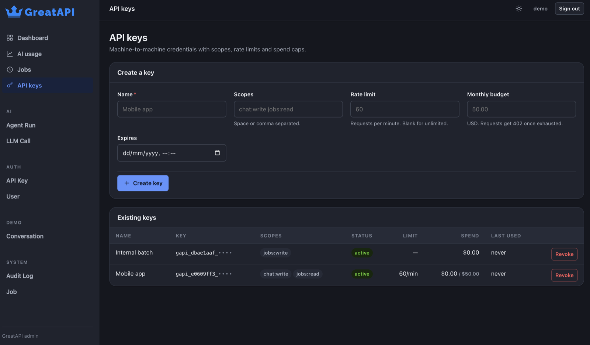

# API keys and quotas

A backend consumed by other services needs a credential that is not a browser
session. GreatAPI keys carry scopes, a rate limit and a monthly spend cap.

## Issuing

From `/admin/api-keys`:



or in code:

```python
from greatapi.keys import create_api_key

record, plaintext = await create_api_key(
    session,
    name="Mobile app",
    scopes=["chat:write", "jobs:read"],
    rate_limit_per_minute=60,
    monthly_budget_usd=50.0,
)
```

`plaintext` is the only copy that will ever exist. Only its SHA-256 digest is
stored, so a database dump hands over nothing usable and there is no "reveal"
action to build — the server genuinely cannot show it again. The `prefix` is
kept in clear purely so a human can tell two keys apart.

## Requiring one

```python
from fastapi import Depends
from greatapi.keys import require_api_key
from greatapi.db import APIKey

@app.post("/chat")
async def chat(key: APIKey = Depends(require_api_key("chat:write"))):
    ...
```

Callers send it either way:

```bash
curl localhost:8000/chat -H 'Authorization: Bearer gapi_...'
curl localhost:8000/chat -H 'X-API-Key: gapi_...'
```

## What the caller gets back

| Status | Meaning |
|---|---|
| `401` | Missing, unknown, revoked or expired key |
| `403` | Valid key, but missing a required scope |
| `429` | Over the per-minute rate limit — with `Retry-After` |
| `402` | Monthly budget exhausted |

Distinct on purpose: a client can retry a `429` and must not retry a `403`.

## Budgets

The cap is checked against recorded `LLMCall` cost for the current UTC month, so
it only means anything with [pricing configured](ai/usage.md). Spend is cached
briefly — a budget is a guard rail, not an accounting ledger, and aggregating on
every request would cost more than it saves.

## Rate limiting across processes

The default limiter keeps a sliding window in memory: exact for one process,
approximate across several. For a hard global ceiling, supply your own:

```python
from greatapi.keys import RateLimiter, set_rate_limiter

class RedisRateLimiter:
    async def hit(self, key: str, limit: int, window_seconds: float) -> float | None:
        """Return None to allow, or seconds to wait."""
        ...

set_rate_limiter(RedisRateLimiter())
```

## Rotating

Revoke from the admin, or:

```python
from greatapi.keys import revoke_api_key

await revoke_api_key(session, key_id)
```

Revocation is immediate. To rotate without downtime, issue the new key, deploy
it, then revoke the old one.
