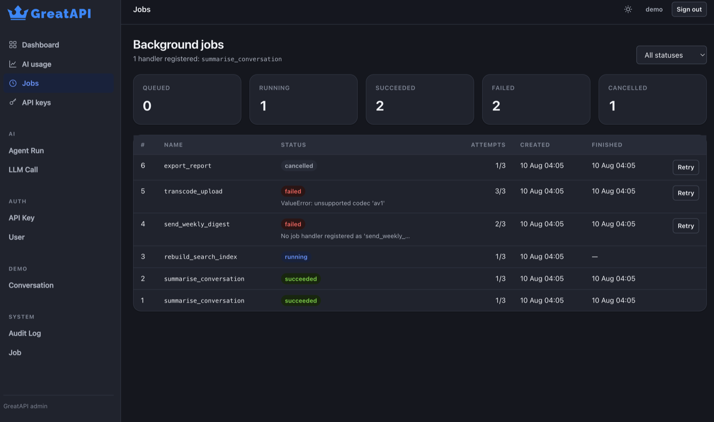

# Background jobs

Inference, batch imports and report generation outlive the request that asked
for them. FastAPI's `BackgroundTasks` cannot help: it dies with the process and
leaves no trace of what ran.

GreatAPI jobs live in the database, so they survive a restart, retry with
backoff, and are visible in the admin. The worker runs inside the application,
so `greatapi runserver` gives you working background jobs with no extra
infrastructure.

## Defining and queueing

```python
from greatapi.jobs import enqueue, job

@job("summarise")
async def summarise(document_id: int) -> str:
    document = await load(document_id)
    result = await ai.complete(messages=f"Summarise: {document.body}")
    return result.text
```

```python
@app.post("/documents/{document_id}/summarise")
async def request_summary(document_id: int):
    queued = await enqueue(summarise, document_id=document_id)
    return {"job_id": queued.id, "poll": f"/jobs/{queued.id}"}
```

Handlers must be `async`. A blocking one would stall every other job in the
worker, so registering a sync function raises.

## Polling

```bash
curl localhost:8000/jobs/1
```

```json
{
  "id": 1,
  "name": "summarise",
  "status": "succeeded",
  "attempts": 1,
  "max_attempts": 3,
  "result": "The document argues that...",
  "error": null,
  "created_at": "2026-08-09T12:00:00Z",
  "finished_at": "2026-08-09T12:00:04Z"
}
```

`queued` → `running` → `succeeded` | `failed` | `cancelled`.

`/admin/jobs` shows the queue with counts per state, a status filter, and Retry
and Cancel on the rows where they apply.



## Retries

A failure is retried with quadratic backoff — 1s, 4s, 9s, capped at five minutes
— until `max_attempts`, then the job is marked `failed` with its traceback and
left alone.

```python
@job("flaky", max_attempts=5)
async def flaky() -> None: ...

await enqueue(flaky, max_attempts=1)          # or per call
```

Retry a dead job by hand from `/admin/jobs`.

## Scheduling

```python
from datetime import timedelta
from greatapi.db import utcnow

await enqueue(summarise, document_id=7, run_at=utcnow() + timedelta(hours=1))
```

## Shutdown

Stopping the server lets in-flight jobs finish, up to a timeout. Anything still
running is put back on the queue rather than left stuck in `running`, so a
deploy does not lose work.

## Configuration

```bash
GREATAPI_JOBS_ENABLED=true
GREATAPI_JOBS_WORKER_CONCURRENCY=4
GREATAPI_JOBS_POLL_INTERVAL_SECONDS=1.0
GREATAPI_JOBS_DEFAULT_MAX_ATTEMPTS=3
```

## Running workers separately

The in-process worker is right until it is not. To move it out, run the web
process with `jobs=False` and a second process with only the worker:

```python
app = GreatAPI(title="myapp", jobs=False)
```

```python title="worker.py"
import asyncio
from greatapi.jobs import Worker
import myproject.settings  # noqa: F401 - imports the job handlers

asyncio.run(Worker().run())
```

Claiming is safe across processes: Postgres uses `FOR UPDATE SKIP LOCKED`, and
SQLite — which has no such clause — confirms each claim with a conditional
`UPDATE` whose row count says whether this worker won the race.
